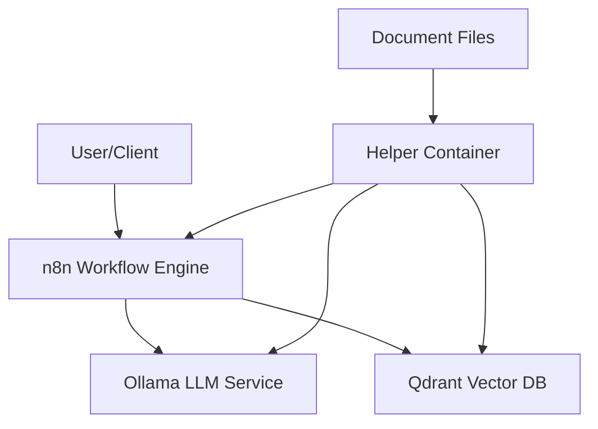

# AI Automation Platform

<div align="center">
  
  <p>
    <em>A Docker-based platform for building AI applications and agents using n8n, Ollama, and Qdrant</em>
  </p>

  [](https://opensource.org/licenses/MIT)
  [](https://github.com/yourusername/ai-automation/actions)
  [](https://www.docker.com/)
  [](https://n8n.io/)
</div>

## 📋 Overview

The AI Automation Platform is an open-source toolkit that enables developers to build, deploy, and manage AI-powered applications and agents with minimal effort. By combining the power of:

- **[n8n](https://n8n.io/)**: A workflow automation tool for creating custom integrations and workflows
- **[Ollama](https://ollama.ai/)**: A framework for running large language models locally
- **[Qdrant](https://qdrant.tech/)**: A vector database for efficient similarity search

This platform provides everything you need to create sophisticated AI applications, from simple chatbots to complex RAG (Retrieval Augmented Generation) agents that can access and reason over your data.

## ✨ Features

- **🔄 Workflow Automation**: Build complex AI workflows using n8n's visual editor
- **🤖 Local LLM Integration**: Run powerful language models locally with Ollama
- **🔍 Vector Search**: Store and retrieve documents semantically with Qdrant
- **📄 Document Ingestion**: Process and embed documents for AI retrieval
- **🧩 RAG Implementation**: Create AI agents that can reference your knowledge base
- **🐳 Docker-based**: Easy deployment with Docker Compose
- **🔌 Extensible**: Add custom components and integrations as needed

## 🚀 Quick Start

### Prerequisites

- [Docker](https://www.docker.com/get-started) and [Docker Compose](https://docs.docker.com/compose/install/)
- Git (to clone the repository)
- 8GB+ RAM recommended for running the LLMs

### Installation

1. Clone the repository:
   ```bash
   git clone https://github.com/yourusername/ai-automation.git
   cd ai-automation
   ```

2. Make the scripts executable:
   ```bash
   chmod +x startup.sh ingest_documents.sh
   ```

3. Start the platform:
   ```bash
   ./startup.sh
   ```

4. Access the services:
   - **n8n**: [http://localhost:5678](http://localhost:5678)
   - **Qdrant**: [http://localhost:6333](http://localhost:6333)
   - **Ollama**: [http://localhost:11434](http://localhost:11434)

## 📖 Usage

### Basic LLM Query

Test the basic LLM query workflow:

```bash
curl -X POST http://localhost:5678/webhook/query \
  -H "Content-Type: application/json" \
  -d '{"query": "What is artificial intelligence?"}'
```

### Document Ingestion

1. Place your text documents in the `data/documents` directory
2. Run the ingestion script:
   ```bash
   ./ingest_documents.sh
   ```

### RAG-enabled AI Agent

After ingesting documents, query your knowledge base:

```bash
curl -X POST http://localhost:5678/webhook/rag-query \
  -H "Content-Type: application/json" \
  -d '{"query": "What does the document say about machine learning?"}'
```

## 🏗️ Architecture

The platform consists of four main components:

1. **n8n**: The workflow automation engine that orchestrates the AI workflows
2. **Ollama**: Provides LLM capabilities for text generation and embeddings
3. **Qdrant**: Vector database for storing and retrieving document embeddings
4. **Helper Container**: Python environment for running utility scripts

These components work together to provide a complete AI application development environment:



## 📁 Repository Structure

```
ai-automation/
├── .github/workflows/      # CI/CD workflows
├── docker/                 # Docker configuration files
├── scripts/                # Python utility scripts
├── workflows/              # n8n workflow definitions
├── docs/                   # Documentation
├── data/                   # Data storage
├── config.json             # Platform configuration
├── requirements.txt        # Python dependencies
├── startup.sh              # Platform startup script
└── ingest_documents.sh     # Document ingestion script
```

## 🛠️ Configuration

The platform can be configured by editing the `config.json` file:

```json
{
  "llm": {
    "provider": "ollama",
    "host": "http://ollama:11434",
    "model": "llama3",
    "parameters": {
      "temperature": 0.7,
      "max_tokens": 2048
    }
  },
  "vectordb": {
    "provider": "qdrant",
    "host": "http://qdrant:6333",
    "collection_name": "documents",
    "embedding_model": "sentence-transformers/all-MiniLM-L6-v2",
    "dimension": 384
  },
  "n8n": {
    "host": "http://n8n:5678",
    "api_key": "",
    "workflows": {
      "basic_llm_query": "/app/workflows/basic_llm_query.json",
      "rag_ai_agent": "/app/workflows/rag_ai_agent.json"
    }
  }
}
```

## 📚 Documentation

Detailed documentation is available in the `docs/guides` directory:

- [Getting Started Guide](docs/guides/getting_started.md)
- [Building AI Agents](docs/guides/building_agents.md)
- [Using Custom Models](docs/guides/custom_models.md)

## 🧪 Examples

The platform includes example data and workflows to help you get started:

- **Sample Document**: `data/examples/sample_document.txt`
- **Sample Query**: `data/examples/sample_query.json`
- **Basic LLM Query Workflow**: `workflows/basic_llm_query.json`
- **RAG AI Agent Workflow**: `workflows/rag_ai_agent.json`

## 🤝 Contributing

Contributions are welcome! Please feel free to submit a Pull Request.

1. Fork the repository
2. Create your feature branch (`git checkout -b feature/amazing-feature`)
3. Commit your changes (`git commit -m 'Add some amazing feature'`)
4. Push to the branch (`git push origin feature/amazing-feature`)
5. Open a Pull Request

## 📄 License

This project is licensed under the MIT License - see the [LICENSE](LICENSE) file for details.

## 🙏 Acknowledgements

- [n8n](https://n8n.io/) - Workflow automation tool
- [Ollama](https://ollama.ai/) - Run large language models locally
- [Qdrant](https://qdrant.tech/) - Vector database for similarity search
- [LangChain](https://langchain.com/) - Framework for LLM applications
- [Sentence Transformers](https://www.sbert.net/) - Text embeddings